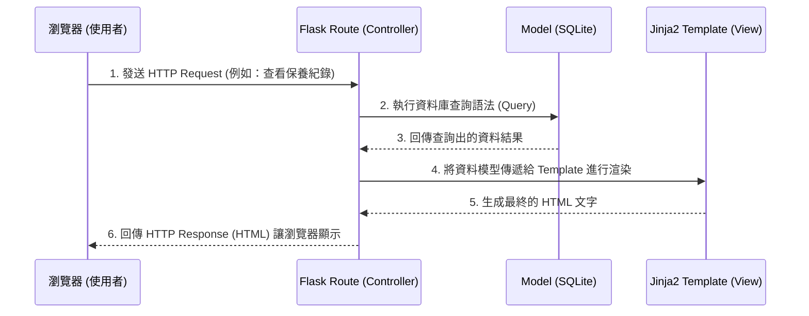

# 系統架構設計文件 (Architecture)

本文件基於「機車保養與改裝紀錄系統」的 PRD 需求，規劃出專案的技術架構與資料夾結構。

## 1. 技術架構說明

本系統採用經典的 **MVC (Model-View-Controller)** 設計模式，搭配沒有前後端分離的一體化架構 (Monolith Application)，適合中小型專案以及追求快速驗證的開發。

### 選用技術與原因
- **後端框架：Python + Flask**。輕量彈性、學習曲線較為平緩，可以非常迅速地建立起 Web 應用程式的路由與商業邏輯。
- **模板引擎：Jinja2**。與 Flask 緊密整合，能無縫地在 HTML 中動態渲染由後端查詢出的車庫與保養資料。
- **資料庫：SQLite**。不需要額外架構資料庫伺服器（如 MySQL / PostgreSQL），只需單一檔案即可存放所有關聯資料，完全符合個人專案或 MVP 的輕量化需求。

### Flask MVC 模式說明
- **Model (模型)**：負責定義資料結構與操作邏輯。我們將透過操作 SQLite 資料庫來處理「車輛資訊」、「保養紀錄」、「願望清單」的寫入與讀取。
- **View (視圖)**：負責將資料呈現給使用者。由包含 Jinja2 標籤的 `.html` 檔案以及搭配的 CSS/JS 構成。
- **Controller (控制器)**：由 Flask 的應用程式路由 (Routes) 扮演。當使用者發出請求（例如點擊「修改保養紀錄」），Controller 會呼叫 Model 抓取或儲存資料，再將結果交給 View 渲染 HTML 回傳給瀏覽器。

## 2. 專案資料夾結構

本系統的核心資料夾與檔案預期結構如下：

```text
motorcycle-tracker/
├── app/
│   ├── models/           ← 資料庫模型：負責與 SQLite 檔案溝通，處理資料表的增刪改查邏輯。
│   ├── routes/           ← 路由控制器 (Controllers)：Flask Blueprint 控制器，區分如車庫、保養、改裝等邏輯塊。
│   ├── templates/        ← 視圖模板 (Views)：存放包含 Jinja2 語法的 HTML 頁面 (如 dashboard.html 等)。
│   └── static/           ← 靜態資源：存放 CSS 樣式表、JavaScript 及圖片檔。
├── instance/
│   └── database.db       ← SQLite 資料庫檔案：系統啟動後產生，放置於 instance/ 以避免版控外洩。
├── docs/                 
│   ├── PRD.md            ← 產品需求文件
│   └── ARCHITECTURE.md   ← 本系統架構文件
├── requirements.txt      ← 專案相依賴的 Python 套件清單 (如 flask 等)。
└── app.py                ← 應用程式進入點：負責建立 Flask 實例並註冊所有模組與路由。
```

## 3. 元件關係圖

以下展示當使用者瀏覽網頁時，系統中核心元件的互動流向：



## 4. 關鍵設計決策

1. **伺服器端渲染 (SSR) 搭配 Jinja2**
   - *原因*：由於為 MVP 階段專案，無需複雜的前端狀態管理 (不需要 React/Vue 動態框架)。直接在伺服器端讀取資料並渲染成 HTML，可大幅降低前端 API 串接的複雜度。
2. **採用 Flask Blueprints 進行路由模組化**
   - *原因*：為了避免所有 Route 都積壓在同一個檔案內，我們將會切割至少三個 Blueprint：「車庫資訊 (Garage)」、「保養紀錄 (Maintenance)」與「改裝願望清單 (Wishlist)」，藉此提升程式碼的可維護性。
3. **完全在地端單一檔案的 SQLite 資料管理**
   - *原因*：針對機車保養管理的個人需求而言，資料量並不大。SQLite 不需要任何背景伺服器支持，不僅降低開發設定門檻，後續要備份個人的保養紀錄時，也只需複製 `database.db` 這一個檔案即可。
4. **將資料庫與應用實例分離 (instance/ 目錄保護)**
   - *原因*：這是 Flask 專案的標準作法。敏感且常異動的本地端檔案 (如資料庫 `.db` 檔或設定檔) 會放在 `instance/` 下，並被加入至 `.gitignore` 中，確保資料庫內容不會意外被 commit 至 GitHub。
