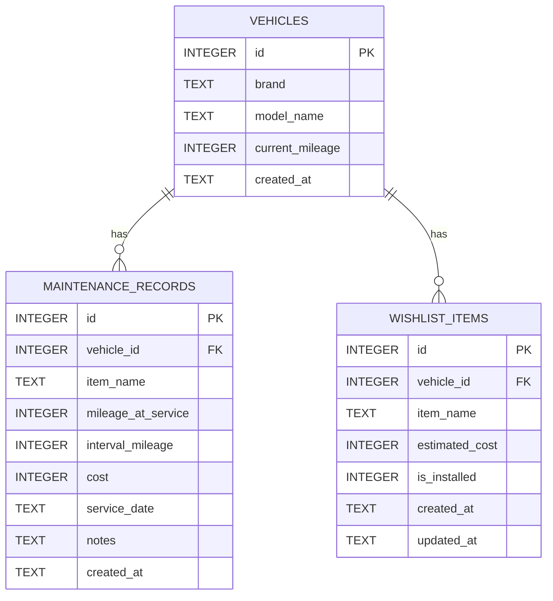

# 資料庫設計文件 (DB Design)

本文件描述「機車保養與改裝紀錄系統」的資料庫 Schema 與資料表關聯，主要包含車輛、保養紀錄與改裝願望清單三個實體。

## 1. ER 圖 (實體關係圖)

## 2. 資料表詳細說明

### 2.1 車輛資訊表 (`vehicles`)

負責記錄車主名下的機車基本資料。

| 欄位名稱 | 型別 | 必填 | 說明 |
| :--- | :--- | :--- | :--- |
| `id` | INTEGER | 是 | 主鍵 (Primary Key, Auto Increment) |
| `brand` | TEXT | 是 | 廠牌名稱 (如: SYM, YAMAHA) |
| `model_name` | TEXT | 是 | 車款名稱 (如: DRG 2, R15M) |
| `current_mileage`| INTEGER | 是 | 目前儀表板顯示的總里程數 |
| `created_at` | TEXT | 是 | 建立時間 (ISO 格式 ISO8601字串) |

### 2.2 保養紀錄表 (`maintenance_records`)

負責記錄各車輛的每一次保養與耗材更換紀錄。

| 欄位名稱 | 型別 | 必填 | 說明 |
| :--- | :--- | :--- | :--- |
| `id` | INTEGER | 是 | 主鍵 (Primary Key, Auto Increment) |
| `vehicle_id` | INTEGER | 是 | 外部鍵 (Foreign Key 關聯 `vehicles.id`) |
| `item_name` | TEXT | 是 | 保養項目名稱 (如: 機油、空濾、鍊條清潔) |
| `mileage_at_service` | INTEGER | 是 | 保養當下的里程數 |
| `interval_mileage` | INTEGER | 否 | 此保養項目的建議週期里程 (例如 1000)，用於計算下次保養是否到期 |
| `cost` | INTEGER | 是 | 本次保養花費金額 |
| `service_date` | TEXT | 是 | 保養日期 (YYYY-MM-DD) |
| `notes` | TEXT | 否 | 備註說明 |
| `created_at` | TEXT | 是 | 建立時間 (ISO 格式) |

### 2.3 改裝願望清單表 (`wishlist_items`)

記錄車主預計升級或改裝的品項及預算。

| 欄位名稱 | 型別 | 必填 | 說明 |
| :--- | :--- | :--- | :--- |
| `id` | INTEGER | 是 | 主鍵 (Primary Key, Auto Increment) |
| `vehicle_id` | INTEGER | 是 | 外部鍵 (Foreign Key 關聯 `vehicles.id`) |
| `item_name` | TEXT | 是 | 改裝品名稱 (如: 避震器、全取代電腦) |
| `estimated_cost` | INTEGER | 是 | 預估花費 / 預算 |
| `is_installed` | INTEGER | 是 | 狀態：`0` 代表未安裝 (Pending)，`1` 代表已安裝 (Installed) |
| `created_at` | TEXT | 是 | 建立時間 (ISO 格式) |
| `updated_at` | TEXT | 是 | 最後更新時間 (ISO 格式) |
