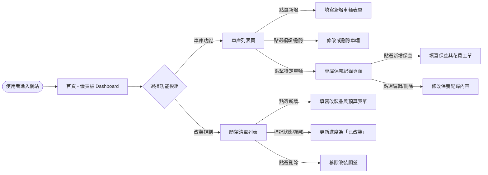
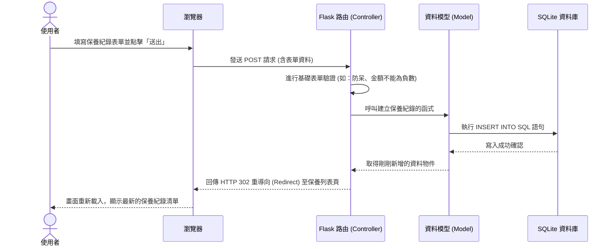

# 系統流程圖設計 (Flowchart)

本文件基於 PRD 與系統架構文件（ARCHITECTURE.md），以視覺化方式呈現「機車保養與改裝紀錄系統」的使用者操作路徑與後端資料流。

## 1. 使用者流程圖 (User Flow)

展示使用者從進入網站後，可以如何導航並操作各項功能。

## 2. 系統序列圖 (Sequence Diagram)

此處以「使用者新增保養紀錄」為例，說明前端表單送出後，資料如何在 Flask 與 SQLite 之間流動。

## 3. 功能清單與 URL 路由對照表

以下整理了系統內所有主要功能、對應的 HTTP 方法與建議的網址路徑，作為後續 API 實作與頁面開發的依據：

| 功能名稱 | HTTP 方法 | URL 路徑 (Route) | 說明 |
| :--- | :--- | :--- | :--- |
| **首頁與儀表板** | GET | `/` | 顯示近期到期保養與總花費概覽。 |
| **車庫列表** | GET | `/garage` | 顯示所有名下車輛。 |
| **新增車輛** | GET / POST | `/garage/add` | GET: 顯示新增表單 POST: 接收資料寫入 DB |
| **編輯車輛** | GET / POST | `/garage/<v_id>/edit` | 修改指定車輛 (`v_id`) 資訊 |
| **刪除車輛** | POST | `/garage/<v_id>/delete` | 刪除車輛及其相關的保養紀錄 |
| **保養紀錄列表** | GET | `/garage/<v_id>/maintenance` | 檢視指定車輛的歷史保養紀錄 |
| **新增保養紀錄** | GET / POST | `/garage/<v_id>/maintenance/add` | 新增該車的保養日誌與花費 |
| **編輯保養紀錄** | GET / POST | `/maintenance/<m_id>/edit` | 修改指定的保養紀錄 (`m_id`) |
| **刪除保養紀錄** | POST | `/maintenance/<m_id>/delete` | 移除該筆保養紀錄 |
| **改裝願望清單** | GET | `/wishlist` | 查看願望清單列表與預算總計 |
| **新增改裝願望** | GET / POST | `/wishlist/add` | 送出新希望安裝的改裝品與估價 |
| **編輯願望狀態** | GET / POST | `/wishlist/<w_id>/edit` | 更新金額或切換「是否已改裝」標籤 |
| **刪除改裝願望** | POST | `/wishlist/<w_id>/delete` | 把不再需要的改裝品從清單移除 |

> **備註**：`v_id` 代表 Vehicle ID (車輛編號)，`m_id` 代表 Maintenance ID (保養紀錄編號)，`w_id` 代表 Wishlist ID (願望清單編號)。所有的刪除操作都是透過 POST 方法執行，以避免爬蟲或預取行為導致資料意外刪除。
